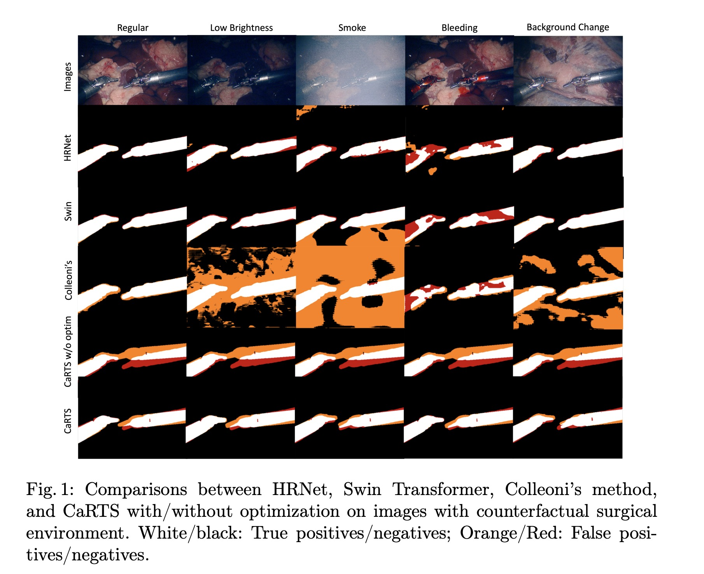
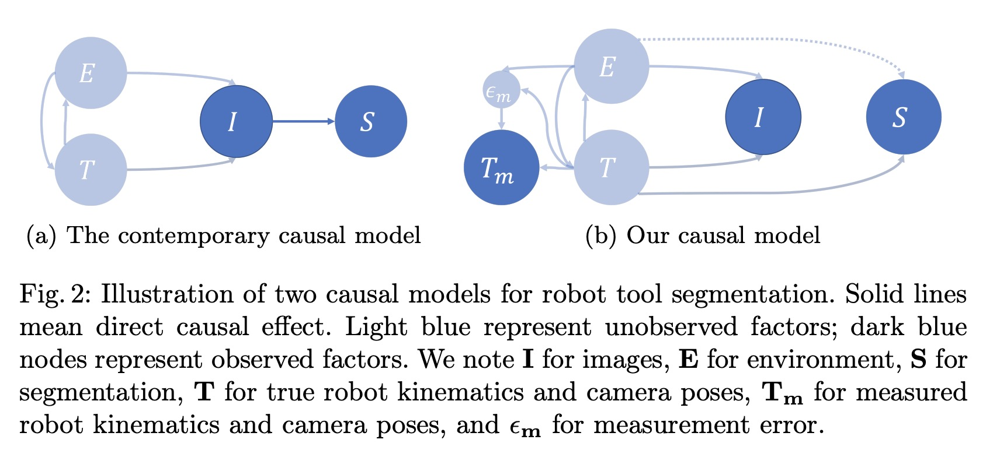
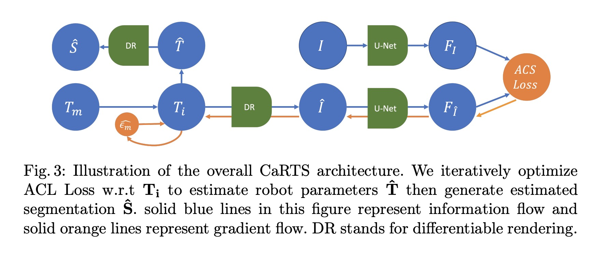
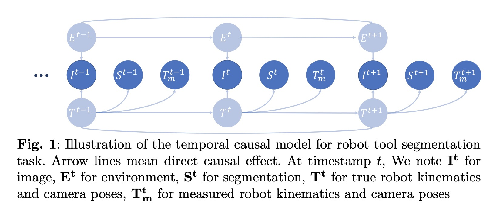
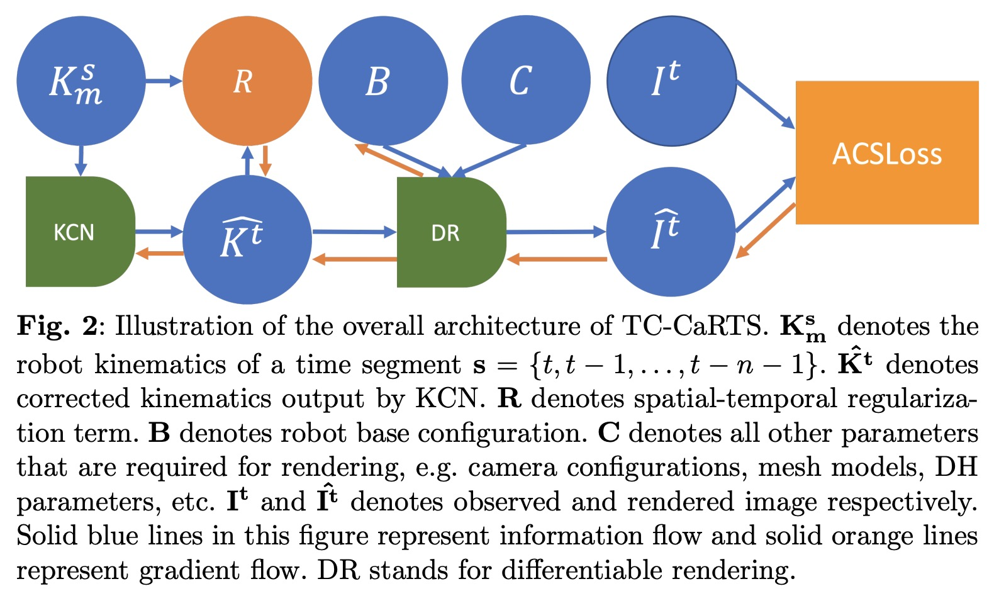

# CaRTS: Causality-driven Robot Tool Segmentation from Vision and Kinematics Data
This repo hosts the code for implementing the CaRTS algorithms for Robot Tool segmentation.

> [**CaRTS: Causality-driven Robot Tool Segmentation from Vision and Kinematics Data**](https://link.springer.com/chapter/10.1007/978-3-031-16449-1_37),            
> Hao Ding, Jintan Zhang, Peter Kazanzides, Jie Ying Wu, Mathias Unberath 
> Proc. MICCAI, 2022  
> *arXiv preprint ([arXiv 2203.09475](https://arxiv.org/abs/2203.09475))*
>
> [**Rethinking Causality-driven Robot Tool Segmentation with Temporal Constraints**](https://link.springer.com/article/10.1007/s11548-023-02872-8),
> Hao Ding, Jie Ying Wu, Zhaoshuo Li, Mathias Unberath
> Int J CARS 18, 1009–1016 (2023)
> *arXiv preprint ([arXiv 2203.09475](https://arxiv.org/abs/2212.00072))*











## Highlights
- **Complementary Causal Model for Robot Tool Segmentation**  
- **Architecture CaRTS, based on the causal model** 

## Installation


### We created an environment.yml for creating the exact same conda envrionment that we ran the code on,You can simply install the environment by this conda command:

    conda env create -f environment.yml

### Our CUDA VERSION is:
    
    Cuda compilation tools, release 12.2, V12.2.128

### Our GPU DRIVER VERSION is:

    535.104.05


## Usage

We only used one GPU for training and inference so we haven't implement multi-gpu version.

### To run training, find the right name for the config you want in the :

python train_nn.py <config_name>

### for example:

python train.py CaRTS_CTS

### To run inference, give the name of the config and the path to the checkpoint file for networks to load:

python test.py <config_name> <path_to_checkpoint> <test_domain>

### for example:

python test.py CaRTS_CTS ./checkpoints/carts/model_49.pth regular

## Dataset preparation:

We are working on make a more comprehensive version of the causal tool segmentation dataset. If you need the dataset that is used in this paper, please contact Hao Ding ([email](mailto:hding15@jhu.edu)) and Mathias Unberath([email](mailto:unberath@jhu.edu)）.

If you want to use your own dataset please write your own dataloader with the same format that as the files in the dataset folder.


## Citations
Please consider citing our papers in your publications if this repo helps you. 
```
@inproceedings{ding2022carts,
  title={CaRTS: Causality-Driven Robot Tool Segmentation from Vision and Kinematics Data},
  author={Ding, Hao and Zhang, Jintan and Kazanzides, Peter and Wu, Jie Ying and Unberath, Mathias},
  booktitle={International Conference on Medical Image Computing and Computer-Assisted Intervention},
  pages={387--398},
  year={2022},
  organization={Springer}
}

@article{Ding2022RethinkingCR,
  title={Rethinking causality-driven robot tool segmentation with temporal constraints},
  author={Hao Ding and Jie Ying Wu and Zhaoshuo Li and M. Unberath},
  journal={International Journal of Computer Assisted Radiology and Surgery},
  year={2022},
  pages={1009 - 1016},
}
```

## License
For academic use, this project is licensed under the 2-clause BSD License - see the LICENSE file for details. For commercial use, please contact Hao Ding ([email](mailto:hding15@jhu.edu)) and Mathias Unberath([email](mailto:unberath@jhu.edu)）
