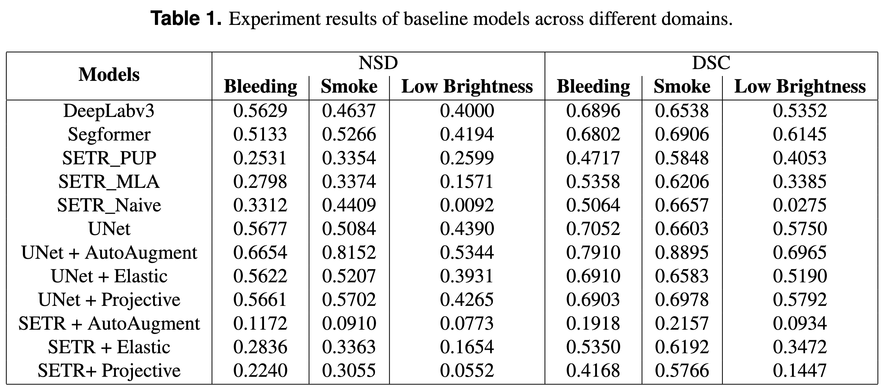

## Baseline Results

We evaluate the performance of baseline models with and without data augmentation across different domains. While all models show reasonable accuracy under regular conditions, their effectiveness substantially deteriorates when tested in shifted domains such as in the presence of bleeding, low brightness, and smoke. The data augmentations applied, including AutoAugment elastic, and projective transformations, generally failed to improve model performance in these domains. Notably, UNet combined with AutoAugment showed a marginal improvement under smoke conditions but this improvement is inconsistent across all domains.  As shown in the table below, under regular conditions, the models adequately segmented tools from the background, but struggled in areas with appearance change and subtle contrast changes. 

Failures are predominantly under bleeding conditions due to the appearance (color) change of the shaft, leading to incorrect segmentation of the shaft. Under low brightness conditions, the darker the region is, the more likely a failure in segmentation will occur. 

The pervasive false positives under smoke conditions indicate that the models interpret the bright regions (smoke) as the foreground. These results suggest that all baseline models are highly dependent on adequate contrast to successfully distinguish between the tools and the background. They are also sensitive to any appearance change for the tool (bleeding) and background (smoke).

Baseline Segmntation Results          |  Baseline Table
:-------------------------:|:-------------------------:
  |  

